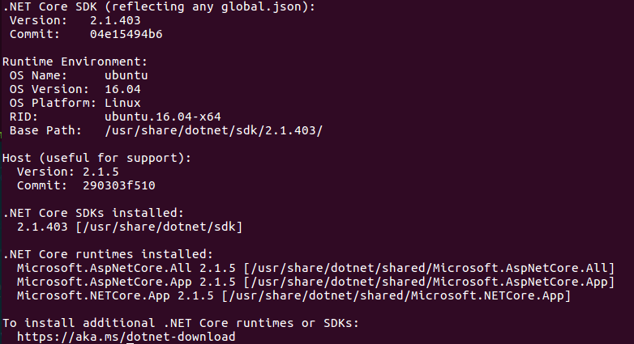
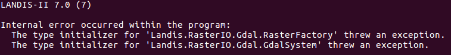
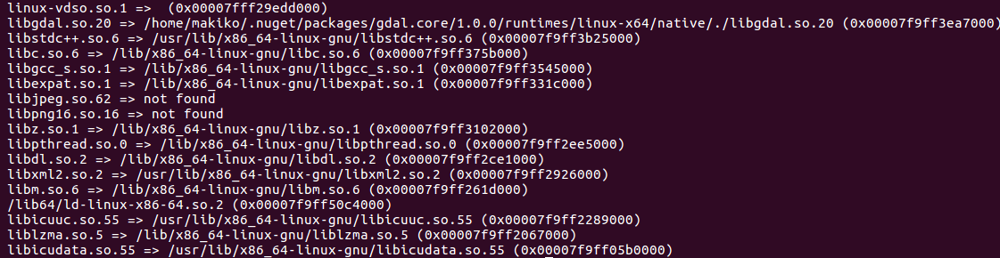
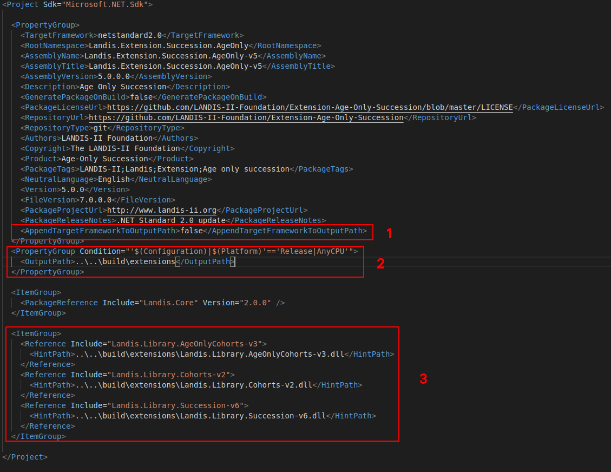
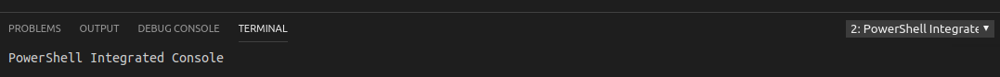

# Core-Model-v7-LINUX

Changes to this extension are governed by the [**Repository Rules**](https://sites.google.com/site/landismodel/developers) from the Technical Advisory Committee (TAC).  The TAC are the Custodians of this repository.

This is the combined package and installer for the LANDIS-II 'Core'.  The Core also contains the following libraries, which are found in separate repositories:

- Library-Core
- Library-Datasets
- Library-Spatial
- Library-Utilities

All Core libraries can be accessed via MyGet https://www.myget.org/feed/Packages/landis-ii-v7

## Ubuntu 16.04 LTS

### LANDIS Core-Model-v7: Framework-dependent deployment (FDD)

1. .NET Core SDK Installation:

* https://www.microsoft.com/net/download
* After the installation check installed SDKs and runtimes in terminal: `dotnet --info`

2. `git clonehttps://github.com/LANDIS-II-Foundation/Core-Model-v7-LINUX.git `

3. `cd /<path to/Core-Model-v7-LINUX/Tool-Console/src`

4. `dotnet build -c Release`

   *Make sure you find all Landis.Console and Landis.Extensions files in Release folder.*
   ├── build
   │   ├── extensions
   │   │   └── extensions.xml
   │   ├── license
   │   │   └── LANDIS-II_Binary_license.rtf
   │   └── Release
   │       ├── Landis.Console.deps.json
   │       ├── Landis.Console.dll
   │       ├── Landis.Console.dll.config
   │       ├── Landis.Console.pdb
   │       ├── Landis.Console.runtimeconfig.dev.json
   │       ├── Landis.Console.runtimeconfig.json
   │       ├── Landis.Extensions.deps.json
   │       ├── Landis.Extensions.dll
   │       ├── Landis.Extensions.dll.config
   │       ├── Landis.Extensions.pdb
   │       ├── Landis.Extensions.runtimeconfig.dev.json
   │       └── Landis.Extensions.runtimeconfig.json

##### Debug (VS Code launch.json)

* "program": "${workspaceFolder}/Tool-Console/src/bin/Debug/Landis.Console.dll"
  * *Make sure your Landis.Console.dll file path*

* "cwd": "<path to your extension scenario text file directory>
* "args": ["<your scenario>.txt"]

### LANDIS-II-v7 Extensions

##### Prerequisites

* All LANDIS-II-v7 supporting libraries and extension DLL must be in `build/extensions` folder.
* LANDIS-II-v7 Extensions information needs to be included in `build/extensions/extensions.xml`

##### Running Scenario

1. `cd <path to your scenario folder>/<your scenario>.txt` 
2. `dotnet /<path to>/Landis.Console.dll scenario.txt`

##### Expected GDAL Related Error

The problem might be GDAL related error if you see error below.

**GDAL dependencies related error fix**

1. `cd /<path to (e.g. home/yourname)>/.nuget/packages/gdal.core/1.0.0/runtimes/linux-x64/native`

2. `ldd gdal_wrap.so`

   *It will show dependencies.  The libjpeg.so.62 and libpng16.so.16 are not found in this case. Install these dependencies.* 

   

   *Install missing dependencies:*

   * `sudo apt-get install libjpeg62`

   * `sudo apt-get install libpng16-16`

##### Compiling LANDIS-II-v7 Extensions

There are many ways to compile LANDIS-II-v7 Extensions.  This is one of the options.

Prerequisite: VS Code installation (see in Notes section)

1. `cd /<path to >/Core-Model-v7-LINUX`

2. `git clone <path to LANDIS-II-v7 Extension>.git`

3. `git clone https://github.com/LANDIS-II-Foundation/Support-Library-Dlls-v7.git`

4. Save all supporting libraries in `build/extensions` folder.

5. Edit **<Landis-ii-v7 Extension>.csproj** file

   1. Add a line below in the first <PropertyGroup> tag (see image below).<AppendTargetFrameworkToOutputPath>false</AppendTargetFrameworkToOutputPath>

   2. Add lines below after the first <PropertyGroup> tag (see image below).

        <PropertyGroup Condition="'$(Configuration)|$(Platform)'=='Release|AnyCPU'">

      ​    <OutputPath>..\..\build\extensions</OutputPath>

        </PropertyGroup>

   3. Modify supporting libraries reference path to:

      `..\..\build\extensions\Landis.Library.<name>.dll`

   

6. Select <extension>.csproj file and right click > **Open in Terminal**

7. `dotnet build`

   *Confirm successful build. You will need to debug If you have a problem with building the extension.*

8. `dotnet build -c Release`

   *See `build/extensions` folder if all supporting libraries and extensions DLLs are created in the folder.*

##### Add LANDIS-II-v7 Extension to extensions.xml

1. `cd <path to where extension information text file direcotry>`

2. `dotnet /<path to>/Core-Model-v7-Linux/build/Release/Landis.Extensions.dll "add" "<extensions infomation>.txt"`

   *To remove an extension:*

   `dotnet /<path to>/Core-Model-v7-Linux/build/Release/Landis.Extensions.dll "remove" "<extensions name (e.g. Age-only Succession)"`

### Notes

##### Visual Studio Code

Installation: 

* https://code.visualstudio.com/docs/setup/linux

* See more detail [Working with C#](https://code.visualstudio.com/docs/languages/csharp)

Note:  You will need  C# for Visual Studio Code extension for application development.

##### Installing PowerShell Core on Linux

Installation: 

* https://docs.microsoft.com/en-us/powershell/scripting/setup/installing-powershell-core-on-linux?view=powershell-6

##### Powershell on VS Code

Prerequisite: PowerShell Core on Linux installation

Installation: 

1. Powershell Extension (ms-vscode.powershell) in VS Code 
2. **View** > **Command Palette...** > *Search for "Powershell"*
3. Select **_PowerShell: Show Integrated Console_**

*Landis Extension supporting library import:*

* `cd <Landis Extension folder path>/src/lib`

* `./support_libs_download.ps1`

